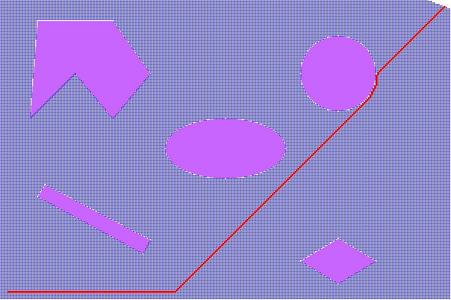
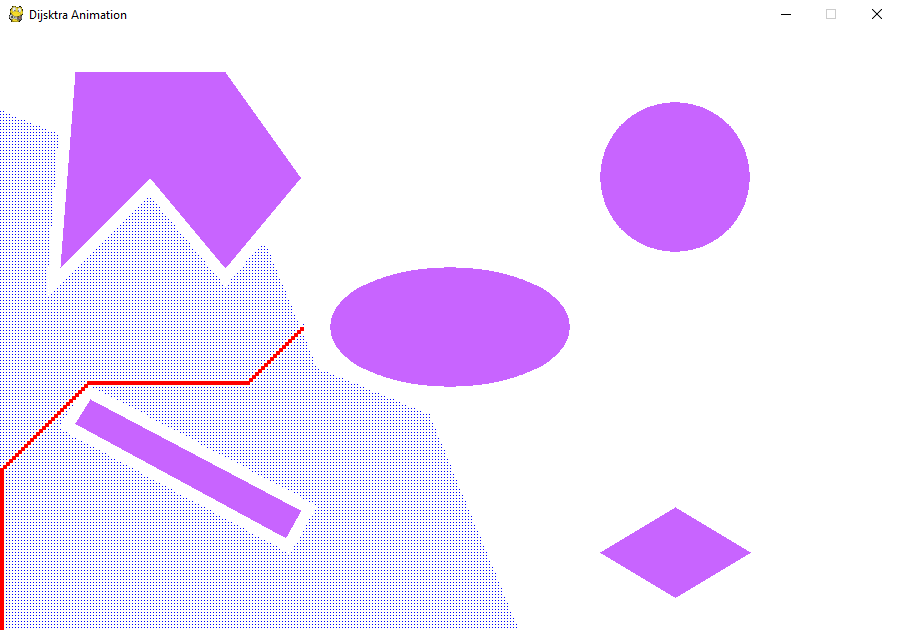

# Dijkstra Path Planner for Point and Rigid Robot
[](https://github.com/RajPShinde/Dijkstra-Path-Planner-for-Rigid-and-Point-Robot/blob/master/LICENSE)

## Authors
Raj Prakash Shinde- 116852104

Prasheel Renkuntla- 116925570

## Description
The project contains the implementation of a Dijkstra path planning algorithm for a Rigid and Point Robot in a space with obstacles. Our approach uses a priority queue for exploring nodes and half-plane equations for defining the obstacles. The exploration and plath is shown in the form of a pygame animation of the solution path is found

## Dependencies
1. Ubuntu 16.04 or Windows
2. Python 3.7 and above
3. pygame
4. defaultdict
5. deque
```
pip install pygame
```

## Output Time
Point Robot - 14 mins (Worst case:5 5 295 195)

Rigid Robot - 14 mins (Worst case:5 5 295 195)
  
## Run
1. To Run Dijkstra for point Robot
```
python3.7 Dijkstra_point.py
```
2. To Run Dijkstra for Rigid Robot
```
python3.7 Dijkstra_rigid.py
```
## Output
1. Dijkstra Point Robot


2. Dijkstra Rigid Robot


## Disclamer
```
MIT License

Copyright (c) 2020 Raj Shinde
Copyright (c) 2020 Prasheel Renkuntla

Permission is hereby granted, free of charge, to any person obtaining a copy
of this software and associated documentation files (the "Software"), to deal
in the Software without restriction, including without limitation the rights
to use, copy, modify, merge, publish, distribute, sublicense, and/or sell
copies of the Software, and to permit persons to whom the Software is
furnished to do so, subject to the following conditions:

The above copyright notice and this permission notice shall be included in all
copies or substantial portions of the Software.

THE SOFTWARE IS PROVIDED "AS IS", WITHOUT WARRANTY OF ANY KIND, EXPRESS OR
IMPLIED, INCLUDING BUT NOT LIMITED TO THE WARRANTIES OF MERCHANTABILITY,
FITNESS FOR A PARTICULAR PURPOSE AND NONINFRINGEMENT. IN NO EVENT SHALL THE
AUTHORS OR COPYRIGHT HOLDERS BE LIABLE FOR ANY CLAIM, DAMAGES OR OTHER
LIABILITY, WHETHER IN AN ACTION OF CONTRACT, TORT OR OTHERWISE, ARISING FROM,
OUT OF OR IN CONNECTION WITH THE SOFTWARE OR THE USE OR OTHER DEALINGS IN THE
SOFTWARE.
```